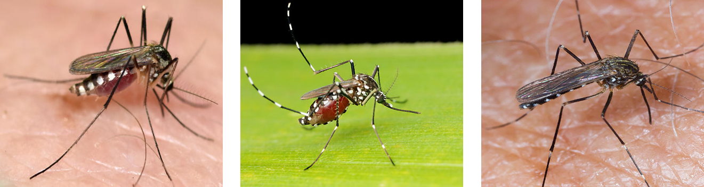
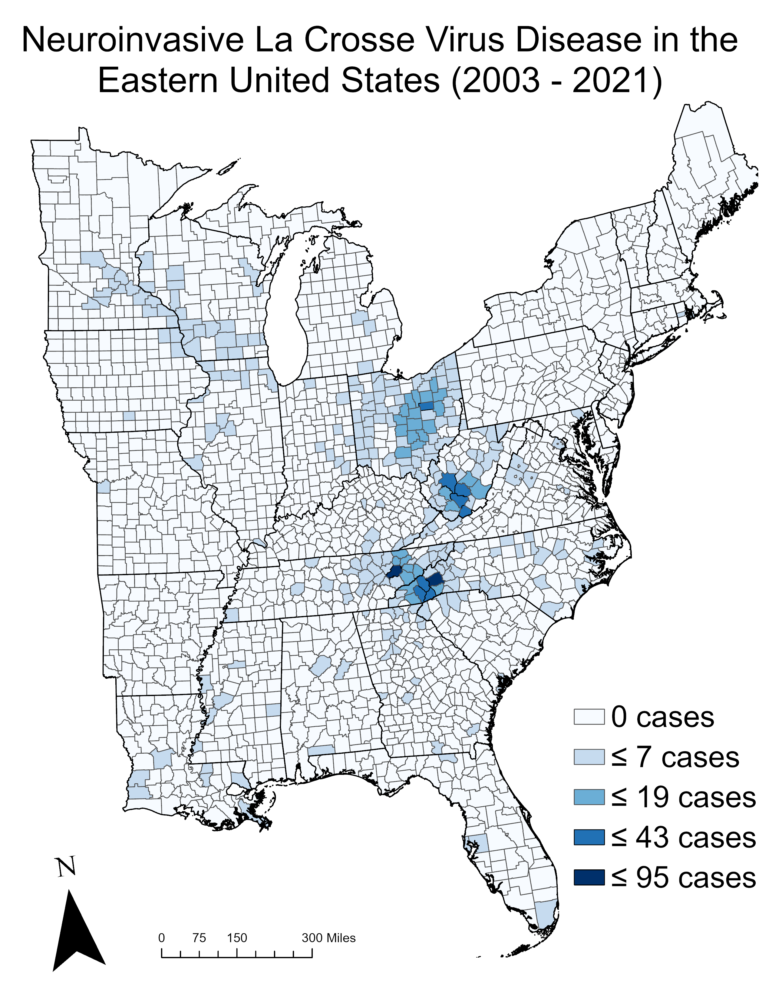

# Have you heard of La Crosse virus? 

Since 2016, I have either been studying or conducting research on some element of the La Crosse virus disease system, and frankly, that fact has been somewhat isolating for me. Even within the world of mosquito-borne disease researchers, few people actively study La Crosse virus. Outside of that world, I have met extremely few people who had ever heard of La Crosse virus at all. That fact is disconcerting to me, because I have spent my entire life residing in Appalachia, where more people are infected with La Crosse virus than anywhere else in the world. Every summer, children in Appalachia will develop a mysterious flu-likely illness that quickly begins to cause seizures, and possibly even comas. Some of those children will develop neurological disabilities that hinder them for years. For most of those children and their parents, their diagnosis will be the first time they learn about La Crosse virus. 

My goal for this post is to produce a reader-friendly description of La Crosse virus disease (i.e., La Crosse encephalitis). Everything I write will be based on peer-reviewed scientific evidence, although I will not provide a full references list as I would in a scientific manuscript. I encourage interested parties to also visit the [CDC's official website](https://www.cdc.gov/lac/index.html). 

# The impact of La Crosse virus disease 

La Crosse virus (LACV) is transmitted by mosquitoes, and it is the second-most common cause of mosquito-borne disease in the United States.  Most of the time, when a human is exposed to LACV, they will never know that it happened. Sometimes (we really don't know how often), a LACV infection causes a generic, flu-like illness that will probably never be diagnosed. Less often (but probably more often than reported), LACV infects the central nervous system, causing neuroinvasive disease. Neuroinvasive LACV disease usually occurs in children, and LACV causes more pediatric neuroinvasive disease than any other mosquito-borne virus in the US. Neuroinvasive LACV infections are usually called La Crosse encephalitis (LACE), because the infection regularly causes encephalitis (i.e., inflammation of the brain). However, neuroinvasive LACV infections may instead result in  meningitis (infection of membranes surrounding the brain) or meningoencephalitis (a combination of encephalitis and meningitis) [see @mcjunkinCrosseEncephalitisChildren2001 for research on the health effects of LACV disease on children]. 

More than 90% of all neuroinvasive LACV disease occurs in children aged 18 years and younger. This is thought to be because young individuals have reduced capacities to prevent LACV infection from reaching the nervous system. Regardless of age, LACV infections are rarely fatal (fewer than 1% of reported infections lead to death). However, the illness can be severe in other ways. Neuroinvasive LACV disease often requires hospitalization, likely in a specialized pediatric hospital. There is no defined treatment for LACV disease, so medical professionals can only provide supportive treatments. The financial costs of treatment, time taken off work for parents, and travel to and from hospitals can be extreme. Worse, because many cases of severe LACV disease cause lifelong neurological disabilities, there are additional costs associated with the disease even after the primary treatment has ended. A study from 2003 found that the total cost of neuroinvasive LACV disease for children who have lifelong consequences could exceed $3 million [see @utzEconomicSocialImpacts2003 for research on economic impacts of LACV disease in North Carolina]. 

# Where is the risk?

\

In the grand scheme of things, LACV disease is rare. For the entire United States, fewer than 100 cases of LACV disease are diagnosed each year. That statistic misses the bigger (or smaller?) picture; LACV infection risk depends heavily on where one lives. Almost every case of LACV disease is associated with a few high-risk areas in either Appalachia or the upper Midwest. Often, when someone is diagnosed with the disease outside of those areas, they recently traveled to one of the high-risk regions before becoming ill. Consistently, LACV disease occurs in the same regions in a select number of counties. The highest risks by-far are for children living in western North Carolina, east Tennessee, West Virginia, and Ohio. In 2018, researchers in North Carolina realized that not only does LACV disease consistently occur in the same counties, but it also occurs at the _same households_. In some cases, this meant that multiple children living at one house became sick during the same year. Surprisingly, they also found that people were also becoming sick at the same household _in different years_. The most extreme example of this was two cases of LACV disease that occurred 7 years apart, with ownership of the home being transferred during that 7-year period [@byrdSpatiallyAssociatedCoincident2018]. 

# What is being done about that risk? 

So, we know that LACV disease consistently occurs in the same states, within the same counties, and even at the same households. This means that risk for this disease is extremely dependent on where a person lives. It also means that there is strong potential for health agencies to target areas with high persistent risks to prevent this disease. So, what is being done about it? The honest answer is **"not much"**. I am not aware of any major public efforts to prevent LACV disease. There are small groups, including the research group I work in, who are [attempting to develop outreach programs](megabitess.org) to raise awareness for this disease in high-risk areas, but that is really the extent of it. That is really a shame, because it is very possible that with resources and effort, we could identify the places where children are going to become infected with LACV, and prevent them from the serious effects those infections can have. Currently, there are no major outreach campaigns, minimal LACV surveillance in mosquitoes, and no active efforts to stop this disease from occurring. 

# How can you protect yourself?

If you live in a county where LACV disease occurs or are traveling to a high-risk area (e.g., a trip to Great Smoky Mountains National Park), **especially if you have children**, I think that you should take LACV risk seriously. Because this is a mosquito-borne disease, the most definitive way to avoid it is to avoid bites from mosquitoes, which we all should want to do anyway regardless of where we are. If you live in the area, the first step you should take is to reduce mosquito habitat on your property. The vectors of LACV (see Fig 1) all use human-made containers which hold standing water as habitats for egg-laying and larval development. If you have containers in your yard (e.g., a wheel barrow, bird bath, used tires, buckets, childrens toys), then take a look for yourself in the summer. If you see little worms wiggling around, then you are watching mosquitoes develop. Having containers like that in your yard is a **proven risk factor for LACV disease and other mosquito-borne diseases**. Not to mention that you have more mosquitoes at your house than you need to. So, **Step 1 is to tip and toss those containers**. You can also check gutters on your house; clogged gutters can make great mosquito habitats. 

Even if you toss those containers, you will still encounter mosquitoes at your house and elsewhere. If you plan to spend time outdoors, the best way to protect yourself from mosquito bites is to apply an [EPA-approved repellent](https://www.epa.gov/insect-repellents/find-repellent-right-you). Anything containing DEET is going to be effective. If you click the link to the EPA repellent site, you can use a search tool to find alternatives if DEET is not an option for you or your family. The good news about DEET-based repellents is that you will also be protected from ticks and other biting insects. Tick-borne diseases are no joke, so it is well-worth your efforts to protect yourself. '

# References 

