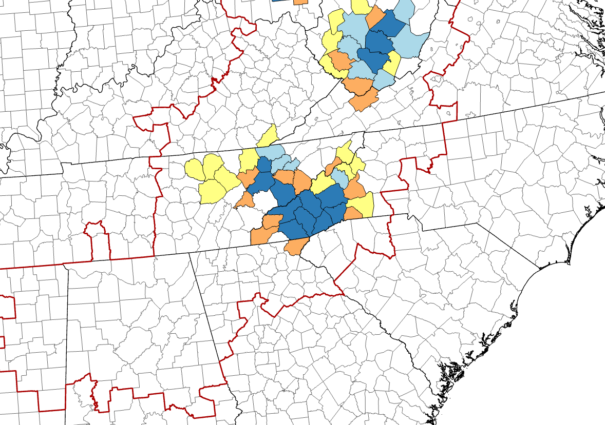

Part of my PhD research focuses on the geographic epidemiology of [La Crosse virus disease](https://www.corey-day.com/research-posts/what-is-la-crosse-virus-disease/), which is a mosquito borne disease that primarily affects children. Prior to my research, there was some evidence that La Crosse virus risk was spatially persistent, meaning that if there is high risk at one location right now, that location will continue to have high risk in the future. If that pattern of spatial persistence is true, then it will be important for future efforts to prevent La Crosse virus infections. Hopefully, we can use the results of this research to find the places where people are most likely to become infected so that we can prevent more children from getting sick. 

There is a need for formal epidemiological analyses using spatial tools to investigate the spatial patterns of La Crosse virus disease. My hypothesis is that the geographic distribution of La Crosse virus disease has remained consistent in the last two decades. To test that hypothesis, I am conducting high-risk disease cluster analyses on multiple geographic scales. First, I am using publicly available data from the United States' arboviral disease database, ArboNET, to investigate disease clustering at the county level in the eastern United States. A county-level disease cluster is a group of neighboring counties that have significantly higher La Crosse virus disease risk than the eastern United States overall. Prior to my work, only one study has investigated La Crosse virus disease clustering at this scale, using data from 2003 to 2007. I repeated the analysis for that time period and additionally investigating clustering in subsequent time periods to compare the distribution of high-risk clusters from 2003 to 2021. This research is currently under peer review, and I will update this page with a link to the open access article once it is published. For now, here is a hint: disease risk has remained persistent in a few clusters of counties for nearly 20 years. 

I will also conduct a fine-scale investigation of risk clustering in partnership with the North Carolina Department of Health and Human Services. North Carolina has some of the highest rates of La Crosse virus disease in the country, and the vast majority of that disease is reported from a few counties in western NC. Whilst ensuring that the privacy of individuals is protected, I will conduct a household-level cluster investigation using the home addresses of all reported La Crosse virus disease in North Carolina from 1997 to 2020. My hypothesis is that the addresses will not be randomly distributed throughout the high-risk counties, but instead that the houses are often clustered together. If that is true, then this work will identify specific areas where people consistently become infected with La Crosse virus, and public health officials can target their prevention efforts directly to those places. This might include virus surveillance, mosquito control, and awareness campaigns to help people protect their children from La Crosse virus disease. 